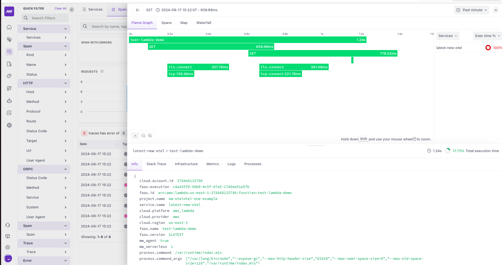

# OpenTelemetry Support for AWS Lambda

This project implements OpenTelemetry support for AWS Lambda functions, allowing for efficient tracing and monitoring of serverless applications.



## Setup Steps

1. **Add the OpenTelemetry Lambda Layer**
   - Choose the appropriate layer for your region from the AWS Lambda console.

2. **Configure Environment Variables**
   Set the following environment variables in your Lambda function:

   ```
   AWS_LAMBDA_EXEC_WRAPPER=/opt/otel-handler
   NODE_OPTIONS=--require ./lambda-config.js // can avoid if want to batch exporter
   OTEL_BSP_SCHEDULE_DELAY=5000 // only if not using lambda-config
   OTEL_EXPORTER_OTLP_ENDPOINT=https://your-otlp-endpoint.com/
   OTEL_LAMBDA_DISABLE_AWS_CONTEXT_PROPAGATION=true
   OTEL_NODE_DISABLED_INSTRUMENTATIONS=dns,net
   OTEL_PROPAGATORS=tracecontext
   OTEL_RESOURCE_ATTRIBUTES=service.name=your-service-name,mw_agent=true,project.name=your-project-name,mw.account_key=your-account-key,mw_serverless=1
   ```

3. **Create a `lambda-config.js` file**
   In your Lambda function's root directory, create a file named `lambda-config.js` with the following content:

   ```javascript
   const { SimpleSpanProcessor } = require('@opentelemetry/sdk-trace-base');
   const { OTLPTraceExporter } = require('@opentelemetry/exporter-trace-otlp-proto');

   global.configureTracerProvider = (tracerProvider) => {
     console.log('Configuring tracer provider with Simple Span Processor');
     const spanProcessor = new SimpleSpanProcessor(new OTLPTraceExporter());
     tracerProvider.addSpanProcessor(spanProcessor);
   };
   ```

4. **Enable X-Ray Tracing**
   Ensure X-Ray tracing is enabled for your Lambda function in the AWS console.

5. **Deploy Your Lambda Function**
   Deploy your function with these changes to start collecting OpenTelemetry data.

## Notes

- The Simple Span Processor is used to ensure immediate processing of spans, which can be beneficial for short-lived Lambda executions.
- Monitor the performance impact and adjust the configuration as necessary for your specific use case.

For more detailed information and troubleshooting, refer to the Middleware documentation and AWS Lambda Opentelemetry guide.
- [Middleware.io Serverless NodeJS Docs](https://docs.middleware.io/apm-configuration/node-js)