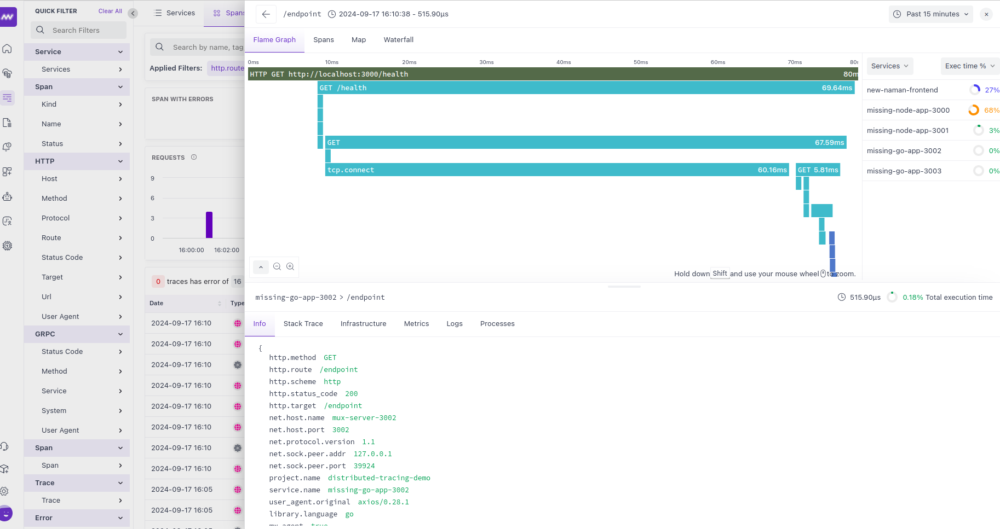

# Distributed Tracing Demo

## Overview

This project demonstrates distributed tracing across multiple services using Middleware APM. It includes:

- A frontend HTML page with RUM (Real User Monitoring)
- Two Node.js backend services
- Two Golang backend services
- Integration with Middleware APM for comprehensive tracing

The application showcases a chain of API calls across different services, allowing you to visualize the complete request flow and identify performance bottlenecks.

## Architecture

```
Frontend (HTML + RUM) -> Node.js App (3000) -> Node.js App (3001) ->
Golang App (3002) -> Golang App (3003)
```

Each service is instrumented with Middleware APM to provide detailed tracing information.

## Prerequisites

- Node.js (v14 or later)
- Go (v1.16 or later)
- npm
- make (optional, for using the Makefile)

## Setup

1. Clone the repository:

   ```
   git clone https://github.com/your-username/distributed-tracing-demo.git
   cd distributed-tracing-demo
   ```

2. Install dependencies:
   If you have `make` installed, run:

   ```
   make install
   ```

   Otherwise, manually install dependencies for each service.

3. Set up environment variables:
   Replace `<MW_API_KEY>` with your actual Middleware API key in all files.

## Running the Application

1. Start all services:
   If using `make`:

   ```
   make run
   ```

   Otherwise, start each service manually in separate terminals:

   ```
   # Terminal 1
   node app1.js

   # Terminal 2
   node app2.js

   # Terminal 3
   cd go-app-3002 && go run main.go

   # Terminal 4
   cd go-app-3003 && go run main.go
   ```

2. Open the `index.html` file in a web browser to access the frontend.

## Usage

1. Click the "Check Health" button on the frontend page.
2. The request will traverse through all services, and you'll see the response in an alert.
3. Check your Middleware APM dashboard to view the distributed trace.



## Service Details

### Frontend (index.html)

- Implements RUM for frontend monitoring
- Makes a request to the first Node.js service

### Node.js App 1 (app1.js)

- Listens on port 3000
- Forwards requests to Node.js App 2

### Node.js App 2 (app2.js)

- Listens on port 3001
- Forwards requests to Golang App 1

### Golang App 1 (go-app-3002)

- Listens on port 3002
- Uses Gorilla Mux for routing
- Forwards requests to Golang App 2

### Golang App 2 (go-app-3003)

- Listens on port 3003
- Uses Gin framework
- Returns the final response

## Makefile Commands

- `make install`: Install dependencies
- `make build`: Build Go applications
- `make run`: Run all applications (may require separate terminals)
- `make stop`: Stop all running applications (requires sudo)
- `make clean`: Remove build artifacts
- `make help`: Display help information

## Troubleshooting

- If you encounter port conflicts, ensure no other applications are using ports 3000-3003.
- For permission issues when running `make stop`, you may need to run it with `sudo`.

## Contributing

Contributions are welcome! Please feel free to submit a Pull Request.

## License

This project is licensed under the MIT License - see the [LICENSE](LICENSE) file for details.
