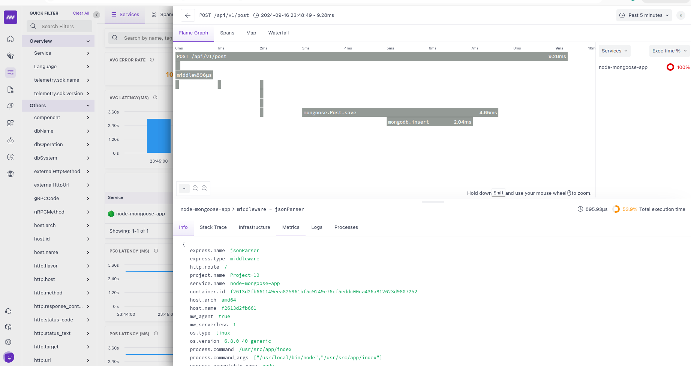

# Blogs-node-api with OpenTelemetry Integration

This is a simple CRUD REST Blogs API demonstrating OpenTelemetry integration for observability. Tech Stack: Node.js, Express, MongoDB, and OpenTelemetry.



## Features

- RESTful API for managing blog posts (Create, Read, Update, Delete)
- OpenTelemetry integration for tracing and monitoring
- MongoDB integration for data storage
- Sorting and filtering capabilities for blog posts
- Docker support for easy deployment
- Unit tests and coverage reporting

## Prerequisites

- Node.js 18 or later
- MongoDB server (or Docker and Docker Compose)
- OpenTelemetry Collector (for receiving and exporting telemetry data)

## Installation

1. Clone the repository:
   ```
   git clone https://github.com/your-username/blogs-node-api.git
   cd blogs-node-api
   ```

2. Install dependencies:
   ```
   npm install
   ```

3. Set up environment variables:
   Copy the `.env.example` file to `.env` and update the values:
   ```
   cp .env.example .env
   ```
   Update the MongoDB URI and OpenTelemetry configuration in the `.env` file.

## OpenTelemetry Integration

This application uses the @middleware.io/node-apm package for OpenTelemetry integration. Key features include:

- Automatic instrumentation of Express.js routes
- Auto-instrumentation of Mongoose calls for MongoDB operations
- Custom span creation for specific operations
- Error logging and tracking
- Configuration of service name and exporter through environment variables

To enable OpenTelemetry in your application, add the following code at the very top of your main application file (e.g., `app.js` or `index.js`):

```javascript
const tracker = require("@middleware.io/node-apm");

process.env.MW_SERVICE_NAME = "node-mongoose-app";
process.env.MW_API_KEY = "your-api-key";
process.env.MW_TARGET = "https://your-target-url.middleware.io";
//process.env.MW_DEBUG = "true";

tracker.track({
  serviceName: process.env.MW_SERVICE_NAME || "simple-express-app",
  agentService: process.env.MW_AGENT_SERVICE,
  accessToken: process.env.MW_API_KEY,
  target: process.env.MW_TARGET,
  DEBUG: process.env.MW_DEBUG ? true : false,
  disabledInstrumentations: "net,dns",
});

// Rest of your application code follows...
```

This initialization code should be placed at the top of your main application file, before any other requires or application logic. This ensures that OpenTelemetry is set up to instrument all subsequent code.

## Usage

### Running Locally

To start the application in development mode:

```
npm start
```

For Docker:

```
docker-compose build
docker-compose up
```

## API Endpoints

- `GET /api/v1/posts` - Get all blog posts (sorting based on created date, blog name, and filters based on category)
- `GET /api/v1/posts/:id` - Get a specific blog post by ID
- `POST /api/v1/posts` - Create a new blog post
- `PUT /api/v1/posts/:id` - Update an existing blog post
- `DELETE /api/v1/posts/:id` - Delete a blog post

## Configuration

The application can be configured using the following environment variables:

- `MW_SERVICE_NAME`: Name of the service for OpenTelemetry (default: "node-mongoose-app")
- `MW_API_KEY`: API key for Middleware.io
- `MW_TARGET`: Target URL for sending telemetry data
- `MW_DEBUG`: Enable debug mode (set to "true" to enable)
- `MW_AGENT_SERVICE`: (Optional) Agent service configuration
- `MONGODB_URI`: MongoDB connection string
- `PORT`: Port on which the server will run (default: 5555)

You can set these environment variables in your `.env` file or directly in your deployment environment.

## Auto-instrumentation

The @middleware.io/node-apm package automatically instruments various Node.js libraries and frameworks, including:

- Express.js routes and middleware
- Mongoose calls for MongoDB operations
- HTTP(S) requests
- And more...

This means that basic telemetry data for your Express routes and MongoDB queries will be collected without any additional code. You can extend this with custom instrumentation as needed for your specific use cases.

## API Examples

### Get all blog posts

#### GET
```
http://localhost:5555/api/v1/posts?category=sports

// cURL
curl --location 'http://localhost:5555/api/v1/posts?category=sports'
```

### Get a Blog post by id

#### GET
```
http://localhost:5555/api/v1/post/64c15a02a104d3f53c19b6c0

// cURL
curl --location 'http://localhost:5555/api/v1/post/64c15a02a104d3f53c19b6c0'
```

### Create a new blog post

#### POST
```
http://localhost:5555/api/v1/post

// Request Body:
{
  "name": "new_post",
  "content": "New Content",
  "category": "sports"
}

// cURL
curl --location 'http://localhost:5555/api/v1/post' \
--header 'Content-Type: application/json' \
--data '{
    "name": "new_post",
    "content": "New Content",
    "category": "sports"
}'
```

### Update a Blog post by id

#### PUT
```
http://localhost:5555/api/v1/post/64c15a02a104d3f53c19b6c0

// Request Body:
{
  "name": "updated_post",
  "content": "Updated Content",
  "category": "technology"
}

// cURL
curl --location --request PUT 'http://localhost:5555/api/v1/post/64c15a02a104d3f53c19b6c0' \
--header 'Content-Type: application/json' \
--data '{
  "name": "updated_post",
  "content": "Updated Content",
  "category": "technology"
}'
```

### Delete a blog post by id

#### DELETE
```
http://localhost:5555/api/v1/post/64c15a02a104d3f53c19b6c0

// cURL
curl --location --request DELETE 'http://localhost:5555/api/v1/post/64c15a02a104d3f53c19b6c0'
```

## Documentation

For detailed information on configuring and using OpenTelemetry with Node.js:

- [OpenTelemetry Node.js Documentation](https://opentelemetry.io/docs/instrumentation/js/getting-started/nodejs/)

## Contributing

Contributions are welcome! Please feel free to submit a Pull Request.

## License

This project is licensed under the MIT License - see the [LICENSE](LICENSE) file for details.