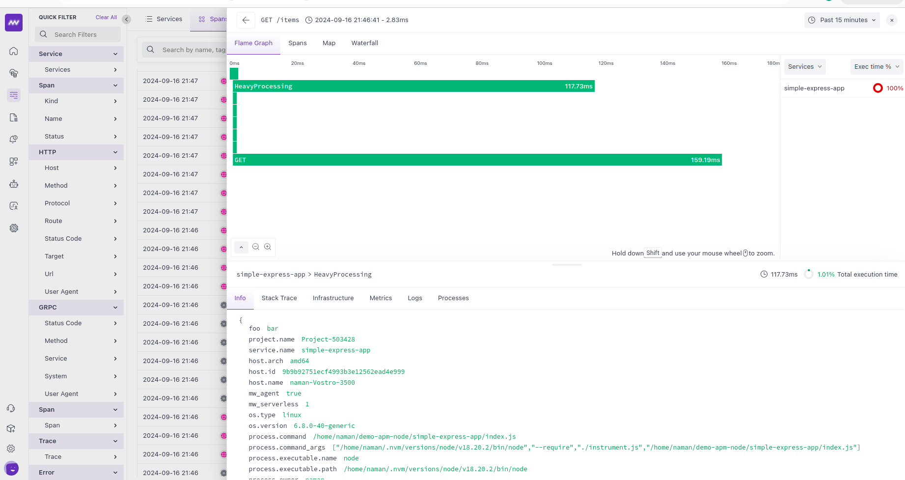

# Simple Express App with OpenTelemetry Integration



## Overview

This repository contains a simple Express.js application that demonstrates the integration of OpenTelemetry for observability. The app provides basic CRUD operations for managing items and showcases how to instrument a Node.js application using the @middleware.io/node-apm package.

## Features

- RESTful API for managing items (Create, Read, Update, Delete)
- OpenTelemetry integration for tracing and monitoring
- Custom span creation and attribute setting
- Error logging and handling
- Dockerized application for easy deployment
- Kubernetes deployment configuration

## Prerequisites

- Node.js 18 or later
- Docker (for containerization)
- Kubernetes cluster (for deployment)

## Installation

1. Clone the repository:
   ```
   git clone https://github.com/your-username/simple-express-app.git
   cd simple-express-app
   ```

2. Install dependencies:
   ```
   npm install
   ```

3. Set up environment variables:
   Copy the `.env.example` file to `.env` and fill in the required values:
   ```
   cp .env.example .env
   ```

## Usage

### Running Locally

To start the application in development mode:

```
npm start
```

To start the application with the Middleware.io agent:

```
npm run start-agent
```

The server will start on `http://localhost:3000`.

### API Endpoints

- `GET /items`: Retrieve all items
- `GET /items/:id`: Retrieve a specific item
- `POST /items`: Create a new item
- `PUT /items/:id`: Update an existing item
- `DELETE /items/:id`: Delete an item

### Docker

To build and run the Docker image:

```
docker build -t simple-express-app .
docker run -p 3000:3000 simple-express-app
```

### Kubernetes

To deploy the application to Kubernetes:

```
kubectl apply -f deployment.yaml
```

## OpenTelemetry Integration

This application uses the @middleware.io/node-apm package to integrate OpenTelemetry. Key features include:

- Automatic instrumentation of Express.js routes
- Custom span creation for specific operations
- Error logging and tracking
- Configuration of service name and API key through environment variables

## Configuration

The application can be configured using the following environment variables:

- `MW_SERVICE_NAME`: Name of the service (default: "simple-express-app")
- `MW_API_KEY`: API key for Middleware.io
- `MW_TARGET`: Target URL for sending telemetry data
- `MW_DEBUG`: Enable debug mode (set to "true" to enable)
- `PORT`: Port on which the server will run (default: 3000)

## Documentation

For detailed information on configuring and using the Middleware.io Node.js APM:

- [Middleware.io Node.js APM Configuration](https://docs.middleware.io/apm-configuration/node-js)

## Contributing

Contributions are welcome! Please feel free to submit a Pull Request.

## License

This project is licensed under the MIT License - see the [LICENSE](LICENSE) file for details.